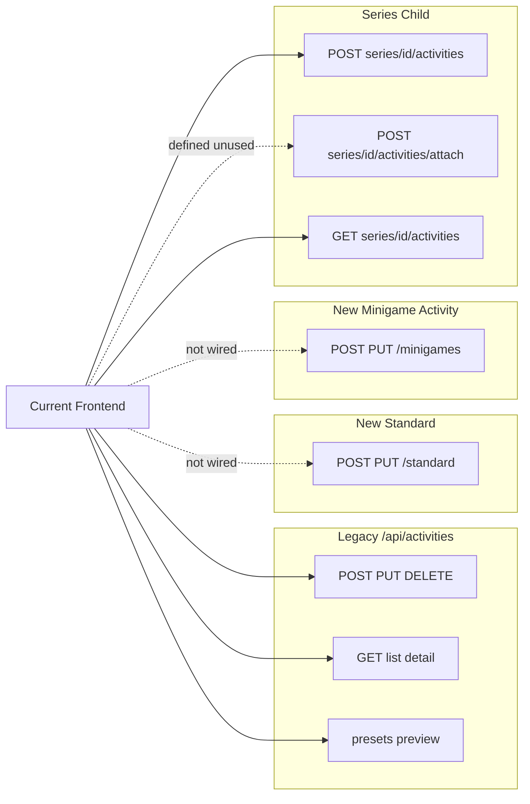

# Frontend–Backend Delta Analysis & Remaining Work Roadmap

**Baseline (excluded from remaining work):** Edit Event/Series/Minigame pages, Score Rules UI + mapping, `targetDepartmentIds`↔`departmentIds`, `presetCode=CUSTOM`, activity-rule semester dropdown (`explicitSemesterId`), Live Score Rules Preview, dynamic penalty/pass-fail rendering, TypeScript build green.

---

## Part 1 – Gap Analysis Table

| Backend Change | Current FE Status | Required FE Work | Risk | Priority |
|---|---|---|---|---|
| **Split CRUD:** `POST/PUT /api/activities/standard` | Not used; [`eventAPI.createEvent`](src/services/eventAPI.ts) / `updateEvent` call legacy `/api/activities` | Add `standardActivityAPI`; wire [`CreateEvent.tsx`](src/pages/CreateEvent.tsx), [`EditEvent.tsx`](src/pages/EditEvent.tsx) (standard branch) | Payload overwrite on mixed-type updates | **P0** |
| **Split CRUD:** `POST/PUT /api/activities/minigames` | Not used; minigame activity create via legacy `createEvent` in [`CreateMinigameWizard.tsx`](src/pages/admin/CreateMinigameWizard.tsx); edit via legacy `updateEvent` | Add `minigameActivityAPI`; route minigame activity metadata CRUD separately from quiz CRUD ([`minigameAPI.ts`](src/services/minigameAPI.ts) already handles quiz) | Same as above; minigame score rules may leak wrong fields | **P0** |
| **Series child CRUD:** `POST /api/series/{id}/activities` + `POST .../attach` | Partial: [`createActivityInSeries`](src/services/seriesAPI.ts) hits `/activities/create`; `addActivityToSeries` hits `/activities` (no `/attach` suffix); **attach UI unused** | Align paths with BE contract; add attach-existing-activity UI in [`SeriesDetail.tsx`](src/pages/admin/SeriesDetail.tsx); route series-child **updates** off legacy PUT | Path mismatch may break on BE deprecation; attach flow missing | **P0** |
| **Legacy** `POST/PUT /api/activities` | Still primary for all non-series-create flows | Deprecate after split migration; keep reads temporarily | Silent data corruption if legacy removed before FE migrates | **P0** |
| DTOs: `StandardActivityCreateRequest`, `MinigameActivityCreateRequest` | Only unified [`CreateActivityRequest`](src/types/activity.ts) exists | Split types in `src/types/`; map forms to type-specific payloads | Wrong fields sent per activity kind | **P0** |
| `GET /api/activities/presets` + `POST .../presets/preview` | Integrated in [`eventAPI.ts`](src/services/eventAPI.ts), used by forms | No change needed | Low | Done |
| `GET /api/series/presets` + `POST .../presets/preview` | Integrated in [`seriesAPI.ts`](src/services/seriesAPI.ts), used by [`SeriesForm.tsx`](src/components/series/SeriesForm.tsx) | No change needed | Low | Done |
| `GET /api/series/{id}/progress/my` + admin student progress | Integrated; consumed by [`StudentSeriesDetail.tsx`](src/pages/StudentSeriesDetail.tsx), [`SeriesProgressBanner.tsx`](src/components/series/SeriesProgressBanner.tsx) | Enhance milestone/progress UI (see Part 3) | Low | **P1** |
| Series fields: `minimumRequirementEnabled/RequiredEvents/PenaltyPoints` | Typed, editable in [`SeriesForm`](src/components/series/SeriesForm.tsx), displayed to students via banner | Add admin read-only display on [`SeriesDetail.tsx`](src/pages/admin/SeriesDetail.tsx); surface in admin progress tab | Admin visibility gap | **P2** |
| Series field: `targetSemesterId` | **Not in types, forms, or API payloads** | Add to [`series.ts`](src/types/series.ts), [`SeriesForm`](src/components/series/SeriesForm.tsx), create/update requests; semester dropdown (reuse academic API from score rules) | Milestone points credited to wrong semester | **P1** |
| `GET /api/series/{seriesId}/overview` (`SeriesOverviewResponse`) incl. `minimumRequirementMetCount` | **Missing from FE spec/types**; FE may be confusing organizer statistics with student progress fields | Add organizer/admin overview typing + service usage where needed. Use `minimumRequirementMetCount` only for aggregate organizer dashboards/charts; keep `minimumRequirementMet` boolean + `completedCount` + `remainingToAvoidPenalty` for student `/progress/my` UX | Organizer dashboard may show wrong aggregate progress if FE reuses student model | **P2** |
| `ActivitySummaryResponse` | BE added summary model; FE roadmap has not audited consumers | Audit Calendar, Dashboard, StudentEvents, ManagerEvents, activity cards/lists/widgets to decide where summary model can replace detail model | Over-fetching and accidental dependency on detail-only fields | **P2** |
| Series child: hide individual score rules | Partially done: [`StudentEventDetail.tsx`](src/pages/StudentEventDetail.tsx) L909–915, [`EventDetail.tsx`](src/pages/EventDetail.tsx) L845–850 | Extend to manager list cards / any remaining score displays for `seriesId != null` | Student confusion about scoring | **P2** |
| `requiresSubmission=false` optional tasks UX | Partial: optional badge in [`StudentEventDetail`](src/pages/StudentEventDetail.tsx), [`StudentTasks.tsx`](src/pages/StudentTasks.tsx) | Audit all task views for overdue/penalty warnings when optional; hide score-related warnings | Incorrect penalty UX | **P2** |
| `requiresSubmission=true` requires `failPoints` | Done in [`EventForm.tsx`](src/components/events/EventForm.tsx) L179–185 | Port same validation to [`BaseEventForm.tsx`](src/components/events/BaseEventForm.tsx) (minigame/series standalone paths) | Invalid configs on minigame create | **P1** |
| Completion = ATTENDED + GRADED messaging | Not surfaced on student activity detail | Add completion checklist/status on [`StudentEventDetail.tsx`](src/pages/StudentEventDetail.tsx) when `requiresSubmission=true` | Students don't understand completion rules | **P2** |
| QR dual flow: student Activity QR → `/checkin/qr` | Done: [`QRCodeCheckIn.tsx`](src/pages/QRCodeCheckIn.tsx) → [`registrationAPI.checkInByQrCode`](src/services/registrationAPI.ts) | None | Low | Done |
| QR dual flow: organizer Ticket QR → `/checkin` | Done: [`ManagerRegistrations.tsx`](src/pages/ManagerRegistrations.tsx), [`EventDetail.tsx`](src/pages/EventDetail.tsx) | Clarify UX copy (CHECKED_IN→ATTENDED vs "check-out" wording) | Organizer confusion | **P3** |
| Minigame `showAnswers` create/edit | Done: [`QuizForm.tsx`](src/components/minigame/QuizForm.tsx), [`EditQuiz.tsx`](src/pages/admin/EditQuiz.tsx) | None | Low | Done |
| Attempt detail respects `showAnswers` | Done: [`QuizResults.tsx`](src/components/minigame/QuizResults.tsx), [`StudentMinigameHistory.tsx`](src/pages/StudentMinigameHistory.tsx) | None | Low | Done |
| No-show penalty + Seminar score-type enforcement | Done in [`EventForm.tsx`](src/components/events/EventForm.tsx) L188–194 | Port to `BaseEventForm` if minigame/standard paths allow NO_SHOW editing | Invalid seminar penalties | **P2** |
| OVERDUE status from BE only | Mostly done in student task views; [`TaskList.tsx`](src/components/tasks/TaskList.tsx) still computes client-side `isOverdue()` | Replace client date comparison with BE `status === OVERDUE` for display | Incorrect overdue display | **P3** |
| `GET /api/scores/ranking` | Done: [`ManagerScores.tsx`](src/pages/ManagerScores.tsx) | Optional: student-facing ranking page (not in handoff action items) | Low | **P3** |
| `POST /api/scores/recalculate/*` | Done: [`ManagerScores.tsx`](src/pages/ManagerScores.tsx) | Add optional `semesterId` param to `recalculateAllScores` per spec; ensure blocking loading UX | Long-running sync ops | **P3** |
| Raw list endpoints (`/my`, `/upcoming`, `/month`, `/score-type/*`, `/department/*`) | Defined in [`eventAPI.ts`](src/services/eventAPI.ts) but **unused**; pages call `getEvents()` + client filter | Migrate [`StudentEvents`](src/pages/StudentEvents.tsx), dashboards, calendar views to scoped endpoints | Performance / pagination at scale | **P2** |
| `TaskSubmissionResponse.attachments` | Done in submission views | None | Low | Done |
| `ScoreEntrySourceType` incl. `SERIES_MINIMUM_REQUIREMENT` | Typed in [`score.ts`](src/types/score.ts); labels in `getSourceTypeLabel` | Verify [`ViewScores.tsx`](src/pages/ViewScores.tsx) / [`ManagerScores.tsx`](src/pages/ManagerScores.tsx) render new source types | History readability | **P3** |
| Points as `string` (BigDecimal) | Mostly string-typed; audit remaining `number` usages | Grep + fix any numeric score fields in display/formatters | Rounding errors | **P3** |

---

## Part 2 – Activity API Migration Status

### Screen migration matrix

| Screen / Flow | Create API | Update API | Read API | Status |
|---|---|---|---|---|
| [`CreateEvent`](src/pages/CreateEvent.tsx) | Legacy POST `/api/activities` | — | — | **Not migrated** |
| [`EditEvent`](src/pages/EditEvent.tsx) standard | — | Legacy PUT `/api/activities/{id}` | Legacy GET | **Not migrated** |
| [`CreateMinigameWizard`](src/pages/admin/CreateMinigameWizard.tsx) | Legacy POST `/api/activities` + POST `/api/minigames` | — | — | **Activity half not migrated** |
| [`EditEvent`](src/pages/EditEvent.tsx) minigame | — | Legacy PUT | Legacy GET | **Not migrated** |
| [`EditQuiz`](src/pages/admin/EditQuiz.tsx) | — | PUT `/api/minigames/{id}` | GET minigame | **Quiz migrated** |
| [`SeriesDetail`](src/pages/admin/SeriesDetail.tsx) create child | POST `/api/series/{id}/activities/create` | — | GET series activities | **Partial** (path + no attach UI) |
| [`EditEvent`](src/pages/EditEvent.tsx) series child | — | Legacy PUT | Legacy GET | **Not migrated** |
| List/detail pages (20+ consumers of `getEvents`/`getEvent`) | — | — | Legacy GET | **Reads still legacy** (acceptable short-term) |

### Technical Debt / Future Enhancement: React Query hooks

**None exist** for activities. All pages use `useEffect` + direct service calls. Do **not** include React Query in the current API migration roadmap: it was not requested in the backend handoff, does not add immediate business value, and can introduce avoidable regression during endpoint migration.

After Activity API migration is complete and stable, React Query can be reconsidered for:

- `useActivity(id)`, `useActivities(filters)`, `useCreateStandardActivity`, `useUpdateMinigameActivity`, `useSeriesActivities(seriesId)`

Recommended future location: `src/hooks/` or colocated in `src/services/` with TanStack Query wrappers.

### DTO types needing replacement

| Current | Replace with |
|---|---|
| `CreateActivityRequest` (unified) | `StandardActivityCreateRequest`, `StandardActivityUpdateRequest` |
| Same for minigame metadata | `MinigameActivityCreateRequest`, `MinigameActivityUpdateRequest` |
| `CreateActivityInSeriesRequest` (minimal) | Align with BE series-child DTO (no `scoreRules`, no milestone fields) |
| `ActivityResponse` | Keep as shared read model until BE splits read endpoints |

---

## Part 3 – Series Integration Review

| Field | In Types? | Displayed? | Editable? | Pages | Recommended UI Placement |
|---|---|---|---|---|---|
| `minimumRequirementEnabled` | Yes ([`series.ts`](src/types/series.ts)) | Student only (banner gate) | Yes — checkbox in [`SeriesForm`](src/components/series/SeriesForm.tsx) | Create/Edit Series; StudentSeriesDetail, StudentEventDetail | **Admin:** read-only badge + summary on [`SeriesDetail`](src/pages/admin/SeriesDetail.tsx) overview tab |
| `minimumRequiredEvents` | Yes | Yes — [`SeriesProgressBanner`](src/components/series/SeriesProgressBanner.tsx) | Yes — number input in SeriesForm | Same as above | **Admin SeriesDetail:** config panel; **Student:** already in banner + [`SeriesProgress`](src/components/series/SeriesProgress.tsx) |
| `minimumPenaltyPoints` | Yes | Yes — warning banner | Yes — number input in SeriesForm | Same | Same as above |
| `minimumRequirementMetCount` | **No** | **No** | No (derived statistic) | Admin/Organizer overview only | Add to `SeriesOverviewResponse` for `GET /api/series/{seriesId}/overview`. This is an aggregate count of students who met the minimum requirement; do not use it for student progress UI. |
| `targetSemesterId` | **No** | **No** | **No** | — | **SeriesForm:** new "Học kỳ cộng điểm milestone" dropdown after score type; null = auto-infer. **SeriesDetail:** read-only display. **Series preset preview:** map from preview response |

**Partial integrations to finish:**
- Admin cannot see minimum-requirement config without opening Edit
- Admin progress tab ([`SeriesDetail`](src/pages/admin/SeriesDetail.tsx)) lacks per-student `minimumRequirementMet` / `remainingToAvoidPenalty`
- Admin/Organizer dashboard overview lacks `SeriesOverviewResponse.minimumRequirementMetCount` support for aggregate minimum-requirement statistics
- `targetSemesterId` entirely missing despite BE request/response support in [FE_BACKEND_HANDOFF_SPEC.md](docs/refactor/FE_BACKEND_HANDOFF_SPEC.md)

### Organizer overview vs Student progress fields

`minimumRequirementMetCount` belongs to the organizer/admin statistics API:

- Endpoint: `GET /api/series/{seriesId}/overview`
- Response type: `SeriesOverviewResponse`
- Purpose: aggregate dashboard/overview statistics for Admin / Organizer
- Meaning: total number of students who have reached the minimum required activity count

Do not confuse this with the student progress API:

- Endpoint: `GET /api/series/{seriesId}/progress/my`
- Student fields: `minimumRequirementMet` (boolean), `completedCount`, `remainingToAvoidPenalty`
- Purpose: personal progress state for the currently authenticated student

---

## Part 4 – Frontend Architecture Assessment

### Current state

- **Shared Activity model:** Yes — single [`CreateActivityRequest`](src/types/activity.ts) + [`ActivityResponse`](src/types/activity.ts) for all types
- **Shared forms:** Partial — [`BaseEventForm`](src/components/events/BaseEventForm.tsx) shared by minigame/series; [`EventForm`](src/components/events/EventForm.tsx) (~848 lines) duplicates shell logic for standard activities
- **Conditional rendering:** Moderate — [`EditEvent.tsx`](src/pages/EditEvent.tsx) 3-way branch; `BaseEventForm` `mode` conditionals (~15+ branches); type checks across 20+ pages

[`StandardActivityForm`](src/components/events/) **does not exist** (name appears only in docs). [`MinigameActivityForm`](src/components/events/MinigameActivityForm.tsx) and [`SeriesActivityForm`](src/components/events/SeriesActivityForm.tsx) already exist.

### Is migration to dedicated forms still necessary?

**Yes — primarily to match split API contracts**, not purely for UI cleanliness.

Legacy unified PUT risks sending minigame/series-irrelevant fields (score rules on series children, etc.) — the exact problem [DELTA_ACTIVITY_API_UPDATE.md](docs/refactor/DELTA_ACTIVITY_API_UPDATE.md) describes.

### Complexity estimate: **Medium (3–5 dev-days API + types, 3–5 dev-days form consolidation)**

| Step | Effort | Files |
|---|---|---|
| 1. Split API services + DTO types | M | [`eventAPI.ts`](src/services/eventAPI.ts) → `standardActivityAPI.ts`, `minigameActivityAPI.ts`; [`types/activity.ts`](src/types/activity.ts) |
| 2. Wire create/update call sites | M | [`CreateEvent.tsx`](src/pages/CreateEvent.tsx), [`EditEvent.tsx`](src/pages/EditEvent.tsx), [`CreateMinigameWizard.tsx`](src/pages/admin/CreateMinigameWizard.tsx), [`SeriesDetail.tsx`](src/pages/admin/SeriesDetail.tsx) |
| 3. Extract `StandardActivityForm` from `EventForm` onto `BaseEventForm` | M | [`EventForm.tsx`](src/components/events/EventForm.tsx), [`BaseEventForm.tsx`](src/components/events/BaseEventForm.tsx) |
| 4. Port validation gaps to `BaseEventForm` | S | failPoints, CHUYEN_DE no-show |
| 5. Series path alignment + attach UI | S | [`seriesAPI.ts`](src/services/seriesAPI.ts), [`SeriesDetail.tsx`](src/pages/admin/SeriesDetail.tsx) |

### Recommended migration order

1. Types + API services (standard → minigame → series child)
2. Create flows (lowest rollback risk)
3. Edit flows (EditEvent branching)
4. Form consolidation (`EventForm` → `StandardActivityForm`)
5. Raw list endpoint adoption and Activity Summary audit

**Out of current migration scope:** React Query hooks. Track as Technical Debt / Future Enhancement after API migration is complete.

**Why current architecture is not sufficient long-term:** All write paths still hit legacy unified endpoints; form duplication causes validation drift (`EventForm` has rules `BaseEventForm` lacks).

---

## Part 5 – Stitch Readiness (UI Modernization)

*Stitch = design-system / visual redesign initiative (no Stitch artifacts in repo). Prioritize pages whose API contracts are stable.*

### Stable enough for Stitch redesign now

| Area | Rationale |
|---|---|
| Score Rules components | Refactor complete: [`ScoreRulesForm`](src/components/events/ScoreRulesForm.tsx), [`ScoreRulesDisplay`](src/components/events/ScoreRulesDisplay.tsx), [`ActivityScoreRulePreview`](src/components/events/ActivityScoreRulePreview.tsx) |
| Minigame quiz play/results | Quiz API stable; `showAnswers` integrated |
| Student QR check-in | [`QRCodeCheckIn.tsx`](src/pages/QRCodeCheckIn.tsx) endpoint correct |
| Manager scores / ranking / recalculate | [`ManagerScores.tsx`](src/pages/ManagerScores.tsx) API integrated |
| Student score history | [`ViewScores.tsx`](src/pages/ViewScores.tsx) |
| Series create/edit form shell | [`SeriesForm`](src/components/series/SeriesForm.tsx) functional (minus `targetSemesterId`) |

### Defer Stitch until API migration complete

| Area | Blocker |
|---|---|
| Create/Edit Event flows | Legacy POST/PUT; payload shape will change |
| Create Minigame wizard (activity step) | Needs `/api/activities/minigames` |
| Series child create/attach in SeriesDetail | Endpoint path + attach flow in flux |
| EditEvent unified page | 3-way branch + API split will reshape layout/props |
| Event list / student event browse | May switch to raw list endpoints |

### Reusable design-system component candidates

Extract during Stitch pass (after API stabilization):

- **ScoreRulesPanel** — form + preview + display trio
- **SemesterSelect** — shared by score rules + series `targetSemesterId`
- **SeriesProgressCard** — banner + milestone + progress bar
- **ActivityTypeBadge** / **PresetSelector**
- **MinimumRequirementConfig** — toggle + two number inputs
- **QRScannerPanel** — student check-in
- **ParticipationStatusStepper** — REGISTERED → CHECKED_IN → ATTENDED → COMPLETED

### Stitch adoption roadmap (priority)

1. **Wave 1:** Score rules kit + ViewScores + ManagerScores (read-heavy, stable)
2. **Wave 2:** Student series progress (after `targetSemesterId` + admin config display)
3. **Wave 3:** Activity create/edit (after Activity API split)
4. **Wave 4:** Event list, dashboards, browse pages (after read endpoint optimization)

---

## Part 6 – Remaining Work Roadmap

### Phase 1 – Critical API Integration (P0)

**Objectives:** Eliminate legacy write paths; align series-child endpoints.

**Files/modules:**
- [`src/services/eventAPI.ts`](src/services/eventAPI.ts) → split write methods
- New: `standardActivityAPI.ts`, `minigameActivityAPI.ts`
- [`src/services/seriesAPI.ts`](src/services/seriesAPI.ts)
- [`src/types/activity.ts`](src/types/activity.ts), [`src/types/series.ts`](src/types/series.ts)
- [`CreateEvent.tsx`](src/pages/CreateEvent.tsx), [`EditEvent.tsx`](src/pages/EditEvent.tsx), [`CreateMinigameWizard.tsx`](src/pages/admin/CreateMinigameWizard.tsx), [`SeriesDetail.tsx`](src/pages/admin/SeriesDetail.tsx)

**Dependencies:** Confirm exact BE paths (`/activities/create` vs `/activities`, `/attach` suffix) with backend team before wiring.

**Risks:** Path mismatch; legacy removal timeline; series-child update endpoint (may need new PUT on series scope).

**Acceptance criteria:**
- Standard create/update uses `/api/activities/standard`
- Minigame activity create/update uses `/api/activities/minigames`
- Series child create uses documented POST; attach-existing-activity works from SeriesDetail
- No write calls to legacy `POST/PUT /api/activities` from migrated flows
- TypeScript build passes; manual CRUD smoke test per activity type

---

### Phase 2 – Activity Architecture Adoption (P0–P1)

**Objectives:** Align forms with split DTOs; reduce conditional duplication.

**Files/modules:**
- [`EventForm.tsx`](src/components/events/EventForm.tsx) → extract [`StandardActivityForm.tsx`](src/components/events/)
- [`BaseEventForm.tsx`](src/components/events/BaseEventForm.tsx) — port failPoints + no-show validation
- [`MinigameActivityForm.tsx`](src/components/events/MinigameActivityForm.tsx), [`SeriesActivityForm.tsx`](src/components/events/SeriesActivityForm.tsx)
- [`EditEvent.tsx`](src/pages/EditEvent.tsx) — route updates to correct API per branch

**Dependencies:** Phase 1 complete.

**Risks:** Regression in preset preview wiring; validation drift during EventForm extraction.

**Acceptance criteria:**
- Each form submits only fields valid for its DTO
- Series child forms never send `scoreRules`
- Shared validation rules consistent across standard/minigame paths
- `EditEvent` delegates update to correct service per activity kind

---

### Phase 3 – Series Feature Completion (P1–P2)

**Objectives:** Full series scoring config including `targetSemesterId`; organizer overview statistics; complete progress UX.

**Files/modules:**
- [`SeriesForm.tsx`](src/components/series/SeriesForm.tsx), [`EditSeries.tsx`](src/pages/admin/EditSeries.tsx)
- [`SeriesDetail.tsx`](src/pages/admin/SeriesDetail.tsx) — config read-only panel + admin progress columns
- [`StudentSeriesDetail.tsx`](src/pages/StudentSeriesDetail.tsx), [`SeriesProgressBanner.tsx`](src/components/series/SeriesProgressBanner.tsx)
- [`series.ts`](src/types/series.ts)
- Organizer/admin dashboard consumers of `GET /api/series/{seriesId}/overview`

**Dependencies:** Phase 1 series API alignment.

**Risks:** Semester auto-infer vs explicit UX confusion.

**Acceptance criteria:**
- `targetSemesterId` in types, form, create/update payloads, and admin detail view
- `SeriesOverviewResponse` typed for `/overview`, including `minimumRequirementMetCount` for aggregate organizer statistics
- Admin sees minimum-requirement config without opening edit
- Admin progress list shows `minimumRequirementMet` / `remainingToAvoidPenalty` per student
- Student series progress shows milestone + minimum requirement (already partial)

---

### Phase 4 – UI Modernization (P2–P3, post-migration)

**Objectives:** Stitch redesign on stable surfaces; UX polish for new BE behaviors.

**Files/modules:**
- Student: [`StudentEventDetail.tsx`](src/pages/StudentEventDetail.tsx) — completion checklist, series score hiding audit
- Student: [`StudentTasks.tsx`](src/pages/StudentTasks.tsx) — optional task overdue hiding
- Manager: [`SeriesDetail.tsx`](src/pages/admin/SeriesDetail.tsx), event list pages
- Activity Summary audit: [`Calendar`](src/pages/Calendar.tsx), dashboard pages, [`StudentEvents`](src/pages/StudentEvents.tsx), [`ManagerEvents`](src/pages/ManagerEvents.tsx), activity cards/lists/widgets
- Design-system extractions listed in Part 5

**Dependencies:** Phases 1–3 for create/edit/list pages.

**Risks:** Redesigning pages before API freeze causes rework.

**Acceptance criteria:**
- Stitch Wave 1–2 components shipped
- P2 Activity Summary audit completed: calendar, dashboards, student/manager event lists, activity cards/lists/widgets classified as summary-safe or detail-required
- No client-side overdue computation for submission status display
- Series child activities never show individual score rules anywhere in student/manager UI

---

### Phase 5 – QA & Cleanup (ongoing)

**Objectives:** Performance, type hygiene, dead code removal.

**Files/modules:**
- [`eventAPI.ts`](src/services/eventAPI.ts) — adopt raw list endpoints or remove dead methods
- [`scoresAPI.ts`](src/services/scoresAPI.ts) — `recalculateAll` semesterId param
- [`types/series.ts`](src/types/series.ts) — remove/sync stale `ActivitySeries`
- [`ManagerRegistrations.tsx`](src/pages/ManagerRegistrations.tsx) — QR flow copy cleanup
- Score string audit across formatters

**Dependencies:** Phases 1–3.

**Risks:** Low — mostly polish.

**Acceptance criteria:**
- No unused legacy API methods called from pages
- E2E checklist passes: standard event w/ submission, minigame w/ showAnswers, series w/ minimum penalty + target semester, student QR check-in, organizer ticket check-in, score history shows SERIES source types

---

## Summary

The frontend has **strong coverage** of preset/score-rules, minigame quiz, QR check-in, series student progress, and manager scoring APIs. The **largest remaining gap** is the **Activity API write-path split** ([DELTA_ACTIVITY_API_UPDATE.md](docs/refactor/DELTA_ACTIVITY_API_UPDATE.md)): all standard/minigame creates and all edits still use legacy `/api/activities`, while series-child create only partially uses the new series-scoped endpoints. Second priority is **`targetSemesterId`** for series (completely missing). Form architecture is **partially split** but **`EventForm` duplication** and unified DTOs should be resolved as part of the API migration—not as a separate cosmetic refactor.
