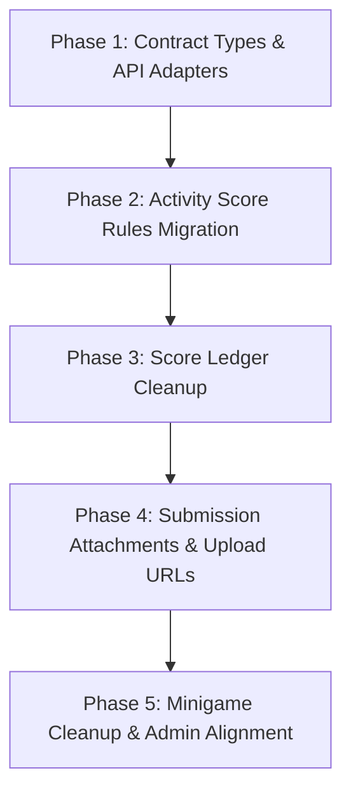

# Front-End Integration Plan: Score Engine Refactor Re-Baseline

Kế hoạch này là bản **re-baseline** của Frontend theo codebase React TypeScript hiện tại, dựa trên:

- [FE_BACKEND_HANDOFF_SPEC.md](file:///d:/2025-2026%20HKI/TLCN/campuslifereact/docs/refactor/FE_BACKEND_HANDOFF_SPEC.md)
- [FE_SCORE_RULES_INTEGRATION_PLAN.md](file:///d:/2025-2026%20HKI/TLCN/campuslifereact/docs/refactor/FE_SCORE_RULES_INTEGRATION_PLAN.md)
- [PROJECT_OVERVIEW.md](file:///d:/2025-2026%20HKI/TLCN/campuslifereact/PROJECT_OVERVIEW.md)

tài liệu này bám theo hiện trạng code trong `src/types`, `src/services`, `src/pages`, `src/components` để:

- phân biệt rõ phần **chưa làm** và phần **đã làm một phần**;
- mở rộng scope ở những khu vực plan cũ chưa phủ hết;
- ưu tiên các thay đổi có nguy cơ làm sai contract với backend thực tế;
- tránh coi những hạng mục đã triển khai phần lớn là một phase lớn độc lập.

---

## User Review Required

> [!IMPORTANT]
> **Các điểm contract FE phải tuân thủ theo backend hiện tại:**
> 1. **BigDecimal phải đi qua FE dưới dạng `string`:** bao gồm `points`, `failPoints`, `currentScore`, `oldScore`, `newScore`, `pointsEarned`.
> 2. **Upload image không dùng wrapper chuẩn:** `POST /api/upload/image` trả về `{ status, message, data }`, trong đó `data` là URL string.
> 3. **Một số endpoint activity trả raw array:** các endpoint filter/list theo score-type, department, my, upcoming, month không trả `body`.
> 4. **Minigame submit dùng object map:** `answers` phải là `Record<string, number>`, không còn là array.
> 5. **Task submission mới hỗ trợ `files` và `images`:** UI nên ưu tiên `attachments`, `fileUrls` chỉ là fallback chuyển tiếp.

---

## Đánh Giá Hiện Trạng

### Đã làm một phần hoặc gần đúng

- `scoresAPI.getScoreHistory` đã truyền `semesterId` đúng và `ViewScores.tsx` đã dùng `scoreHistories[]` và `activityParticipations[]`.
- `submissionAPI.ts` đã dùng endpoint mới `/api/submissions/...` và trường `isCompleted`.
- `StudentMinigamePlay.tsx` đã submit payload minigame theo dạng `{ answers }`.
- `StudentMinigamePlay.tsx` và `QuizResults.tsx` đã ưu tiên `status` và `pointsEarned` trong luồng student play.

### Còn lệch lớn với backend/docs

- `activity.ts` vẫn là flat model cũ hoàn toàn cho activity:
  - chưa có `scoreRules`
  - chưa có `ActivityScoreRuleRequest`/`ActivityScoreRuleResponse`
  - chưa có các enum rule-related như `ScoreRuleTrigger`, `ScoreRuleCalculation`, `ScoreRuleAudience`, `ScoreSemesterPolicy`
- `activity.ts`, `EventForm.tsx`, `EditEvent.tsx`, `EventDetail.tsx`, `StudentEventDetail.tsx`, `EventList.tsx`, `StudentEvents.tsx` vẫn bám mạnh vào `scoreType`, `maxPoints`, `penaltyPointsIncomplete`.
- `BaseEventForm.tsx` vẫn khởi tạo và validate `maxPoints`, nên migration activity không thể chỉ sửa `EventForm.tsx`.
- `MinigameActivityForm.tsx` và các flow tạo activity cho minigame vẫn mang giả định về mô hình điểm cũ.
- `submission.ts` và `submissionAPI.ts` chưa support đầy đủ `attachments` và field upload `images`.
- UI submission vẫn render `fileUrls` ở nhiều nơi, chưa tách `image` và `file`.
- `uploadAPI.ts` vẫn wrap URL thành `{ bannerUrl }` thay vì giữ trực tiếp string từ `data`.
- `imageUtils.ts` vẫn có logic prepend host/base URL ở client.
- `minigame.ts`, `QuizForm.tsx`, `MinigameManagement.tsx` và nhiều màn detail/list vẫn còn `rewardPoints`, `passed`, `attemptId` phục vụ compatibility cũ.
- `TaskForm.tsx` và `admin/TaskManagement.tsx` vẫn còn `maxPoints`, nên task-related UI cũng cần được audit trong cùng migration.

### Kết luận về ưu tiên

- **Phase lớn thực sự còn pending:** activity score rules, task submission attachments, upload adapter cleanup.
- **Phase nên chuyển thành cleanup:** score ledger history, student minigame attempt flow.
- **Phần plan cũ đang thiếu scope:** event list/card, submission modal trong event detail, submission details modal của manager, minigame admin/manager screens.

---

## Nguyên Tắc Triển Khai

1. **Ưu tiên sửa contract trước UI.**
   Nếu type/service còn sai shape thì chưa nên refactor UI diện rộng.

2. **Không refactor kiến trúc rộng cùng lúc.**
   Khuyến nghị `src/api/*` là hợp lý dài hạn, nhưng không đưa vào scope bắt buộc của đợt này nếu mục tiêu chính là đồng bộ contract với backend.

3. **Giữ backward compatibility có kiểm soát trong thời gian ngắn.**
   Có thể giữ `fileUrls`, `rewardPoints`, `attemptId`, `passed` như fallback chuyển tiếp ở type nội bộ, nhưng UI chính không nên tiếp tục phụ thuộc vào chúng.

4. **Triển khai theo vertical slice nhỏ.**
   Mỗi phase nên kết thúc ở trạng thái build được và có thể verify độc lập.

5. **Chốt rõ chiến lược legacy fields trước khi code.**
   Với `maxPoints`, `penaltyPointsIncomplete`, `scoreType`, `rewardPoints`, cần quyết định trước:
   - giữ tạm dưới dạng optional + deprecated;
   - hay loại khỏi UI nhưng giữ trong type để tương thích;
   - hay xóa hoàn toàn khỏi contract FE.

6. **Tách rõ 3 luồng tạo mới ở UI.**
   Không dùng một form activity chung cho cả sự kiện thường, minigame và series.
   - `EventForm.tsx`: chỉ dành cho activity thường.
   - `MinigameActivityForm.tsx`: chỉ dành cho activity minigame.
   - `SeriesForm.tsx` + `SeriesActivityForm.tsx`: là flow riêng cho series và activity con trong series.

7. **Activity thường không được phép chọn `MINIGAME` trong form sự kiện thường.**
   Nếu người dùng muốn tạo minigame, phải đi qua flow minigame riêng.

8. **Activity con trong series dùng form rút gọn.**
   Trong series, user vẫn có thể tạo activity thường hoặc minigame, nhưng chỉ nhập các field thật sự cần cho activity con; các field mang tính cấu hình độc lập hoặc trùng với series phải bị ẩn/khóa hoặc được kế thừa từ series.

---

## Proposed Changes

Kế hoạch mới được chia theo mức độ cần thiết thực tế của codebase hiện tại:

---

### Phase 1: Contract Types & API Adapters

**Mức độ:** `PENDING - PHẢI LÀM TRƯỚC`

Mục tiêu: đồng bộ types và service adapters với contract backend thực tế để các page phía trên không còn parse sai dữ liệu.

#### [MODIFY] [activity.ts](file:///d:/2025-2026%20HKI/TLCN/campuslifereact/src/types/activity.ts)

- Bổ sung các enum/type mới từ backend:
  - `ScoreRuleTrigger`
  - `ScoreRuleCalculation`
  - `ScoreRuleAudience`
  - `ScoreSemesterPolicy`
- Thêm:
  - `ActivityScoreRuleRequest`
  - `ActivityScoreRuleResponse`
- Cập nhật `CreateActivityRequest` và `ActivityResponse`:
  - thêm `scoreRules`;
  - đánh dấu rõ các field cũ `scoreType`, `maxPoints`, `penaltyPointsIncomplete` là legacy transition hoặc loại bỏ khỏi luồng chính.
- Ghi chú rõ trong file/type doc rằng đây là **migration từ model cũ sang model mới**, không phải cleanup nhẹ.

#### [MODIFY] [score.ts](file:///d:/2025-2026%20HKI/TLCN/campuslifereact/src/types/score.ts)

- Thay enum nguồn điểm cũ bằng shape mới:
  - `"ACTIVITY_PARTICIPATION"`
  - `"TASK_SUBMISSION"`
  - `"MINIGAME_ATTEMPT"`
  - `"SERIES_PROGRESS"`
  - `"MANUAL_ADJUSTMENT"`
  - `"RECALCULATION"`
- Chuẩn hóa helper label/color theo enum ledger mới.
- Giữ `string` cho toàn bộ field điểm.

#### [MODIFY] [submission.ts](file:///d:/2025-2026%20HKI/TLCN/campuslifereact/src/types/submission.ts)

- Thêm `SubmissionAttachment` với `{ url: string; type: "file" | "image" }`.
- Cập nhật `TaskSubmissionResponse` để có:
  - `attachments`
  - `fileUrls` là fallback tương thích ngược
  - `isCompleted`
- Mở rộng `CreateSubmissionRequest` và `UpdateSubmissionRequest`:
  - `files?: File[]`
  - `images?: File[]`

#### [MODIFY] [minigame.ts](file:///d:/2025-2026%20HKI/TLCN/campuslifereact/src/types/minigame.ts)

- Giữ `SubmitAttemptRequest.answers` là `Record<string, number>`.
- Giảm phụ thuộc vào legacy fields:
  - `attemptId?`
  - `passed?`
- Rà lại các type create/update để tách rõ:
  - field còn thật sự dùng ở backend;
  - field chỉ còn để phục vụ compatibility tạm thời.

#### [MODIFY] [eventAPI.ts](file:///d:/2025-2026%20HKI/TLCN/campuslifereact/src/services/eventAPI.ts)

- Sửa parser cho các endpoint trả raw array:
  - `getEventsByScoreType`
  - `getEventsByDepartment`
  - `getMyEvents`
  - `getEventsByMonth`
- Nếu cần, bổ sung helper unwrap riêng cho:
  - wrapper chuẩn `{ status, message, body }`
  - raw list `ActivityResponse[]`

#### [MODIFY] [submissionAPI.ts](file:///d:/2025-2026%20HKI/TLCN/campuslifereact/src/services/submissionAPI.ts)

- Append riêng cả `files` và `images` vào `FormData`.
- Giữ normalize response nhất quán cho `attachments`.

#### [MODIFY] [uploadAPI.ts](file:///d:/2025-2026%20HKI/TLCN/campuslifereact/src/services/uploadAPI.ts)

- Dùng adapter riêng cho response upload image.
- `uploadImage()` hiện đã đọc đúng `response.data.data`, nhưng đang bọc lại thành `{ bannerUrl }`; cần bỏ lớp wrap ad-hoc này hoặc thay bằng adapter dùng chung có chủ đích.
- Trả về trực tiếp URL string từ `response.data.data`, hoặc tối thiểu chuẩn hóa một lớp adapter rõ ràng thay vì `bannerUrl` ad-hoc.

#### [MODIFY] [imageUtils.ts](file:///d:/2025-2026%20HKI/TLCN/campuslifereact/src/utils/imageUtils.ts)

- Audit lại toàn bộ logic prepend base URL.
- Mục tiêu cuối là:
  - nếu backend trả absolute URL thì FE giữ nguyên;
  - không tự ghép `/uploads` hoặc host public ở những flow upload mới.

---

### Phase 2: Activity Score Rules Migration

**Mức độ:** `PENDING - PHẠM VI LỚN NHẤT`

Mục tiêu: chuyển activity khỏi mô hình điểm tĩnh và hiển thị/submit theo `scoreRules`.

#### Quyết định kiến trúc cho flow tạo mới

- **Flow 1 - Tạo sự kiện thường**
  - Dùng `EventForm.tsx`.
  - Không cho chọn `ActivityType.MINIGAME` trong dropdown loại sự kiện.
  - Chỉ cho phép các loại activity thường như:
    - `SUKIEN`
    - `CONG_TAC_XA_HOI`
    - `CHUYEN_DE_DOANH_NGHIEP`

- **Flow 2 - Tạo minigame**
  - Dùng `MinigameActivityForm.tsx` và các màn create/edit quiz riêng.
  - `type` được cố định là `MINIGAME`, không cho user đổi qua loại khác trong cùng form.
  - Form này chỉ hiển thị các field phù hợp với minigame activity + quiz flow.

- **Flow 3 - Tạo series**
  - Dùng `SeriesForm.tsx` cho cấu hình series.
  - Activity con bên trong series được tạo qua `SeriesActivityForm.tsx` hoặc flow series-specific tương đương.
  - Activity con trong series vẫn có thể là:
    - activity thường
    - minigame
  - Nhưng chỉ dùng **bộ field rút gọn**, vì nhiều field phải kế thừa hoặc chịu semantics từ series.

#### Nguyên tắc field cho activity con trong series

- **Giữ lại** các field tối thiểu:
  - `name`
  - `description`
  - `type`
  - `startDate`
  - `endDate`
  - `location`
  - `bannerUrl`
  - `requiresSubmission` nếu backend vẫn cần ở activity con
  - các field thực sự cần để gắn organizer/approval nếu contract yêu cầu

- **Ẩn hoặc kế thừa từ series**:
  - `scoreType` gốc nếu điểm được hiểu ở tầng series
  - mọi field điểm tĩnh cũ
  - các field registration/policy đã được series quản lý
  - các field duplicate với cấu hình tổng của series

- **Minigame trong series**
  - Vẫn là `type = MINIGAME`.
  - Dùng bộ field rút gọn của activity con + quiz flow riêng.
  - Không kéo toàn bộ form create event thường vào flow series.

#### Đề xuất chia nhỏ phase này

- **Phase 2a - Form contract migration**
  - `activity.ts`
  - `BaseEventForm.tsx`
  - `EventForm.tsx`
  - `MinigameActivityForm.tsx`
  - `CreateEvent.tsx`
  - `EditEvent.tsx`
- **Phase 2b - Activity display migration**
  - `EventDetail.tsx`
  - `StudentEventDetail.tsx`
  - `EventList.tsx`
  - `StudentEvents.tsx`
- **Phase 2c - Series/task/admin audit**
  - `SeriesActivityForm.tsx`
  - `SeriesActivityList.tsx`
  - `TaskForm.tsx`
  - `pages/admin/TaskManagement.tsx`
  - các màn admin còn tham chiếu `maxPoints` nếu phát hiện thêm trong lúc triển khai

#### [MODIFY] [BaseEventForm.tsx](file:///d:/2025-2026%20HKI/TLCN/campuslifereact/src/components/events/BaseEventForm.tsx)

- Gỡ logic khởi tạo mặc định:
  - `scoreType`
  - `maxPoints`
  - `penaltyPointsIncomplete`
- Loại bỏ validation `maxPoints` khi `requiresSubmission`.
- Chuyển base form sang trạng thái trung lập để các form con render `scoreRules` thay vì ép model điểm cũ.

#### [MODIFY] [EventForm.tsx](file:///d:/2025-2026%20HKI/TLCN/campuslifereact/src/components/events/EventForm.tsx)

- Chuyển form này thành **form tạo activity thường chuyên biệt**.
- Bỏ lựa chọn `ActivityType.MINIGAME` khỏi dropdown loại sự kiện.
- Nếu cần giữ chung component, rename nội bộ hoặc thêm guard để `EventForm` không được submit `type = MINIGAME`.
- Loại bỏ validation bắt buộc `maxPoints` khi `requiresSubmission`.
- Xóa các input:
  - `maxPoints`
  - `penaltyPointsIncomplete`
- Thêm section quản lý `scoreRules`:
  - thêm/xóa nhiều rule;
  - nhập `scoreType`, `triggerType`, `calculation`, `points`, `failPoints`, `audience`, `semesterPolicy`;
  - support `departmentIds` và `explicitSemesterId` khi cần.

#### [MODIFY] [MinigameActivityForm.tsx](file:///d:/2025-2026%20HKI/TLCN/campuslifereact/src/components/events/MinigameActivityForm.tsx)

- Chốt đây là **form tạo activity minigame chuyên biệt**.
- Cố định `type = MINIGAME`.
- Không hiển thị dropdown đổi loại activity trong form này.
- Bỏ các giả định UI dựa vào `scoreType`/`maxPoints` của activity minigame.
- Nếu minigame activity vẫn cần thông tin điểm để giải thích cho người dùng, hiển thị theo `scoreRules` hoặc theo chú thích milestone/quiz flow mới.
- Đồng bộ với `BaseEventForm.tsx` để không còn set state theo model activity cũ.

#### [MODIFY] [CreateEvent.tsx](file:///d:/2025-2026%20HKI/TLCN/campuslifereact/src/pages/CreateEvent.tsx) & [EditEvent.tsx](file:///d:/2025-2026%20HKI/TLCN/campuslifereact/src/pages/EditEvent.tsx)

- `CreateEvent.tsx` chỉ dùng cho activity thường.
- Nếu hiện route này vẫn cho tạo minigame bằng cách chọn type, cần bỏ nhánh đó khỏi UI và navigation.
- Map `initialData` và submit payload sang `scoreRules`.
- Không nạp lại `maxPoints`/`penaltyPointsIncomplete` làm source of truth.

#### [REVIEW/MODIFY] Luồng tạo minigame riêng

- Rà lại các route/page create minigame hiện có để bảo đảm user đi từ:
  - chọn/tạo activity minigame riêng
  - sau đó cấu hình quiz bằng form riêng
- Không để `CreateEvent.tsx` và `MinigameActivityForm.tsx` chồng chéo trách nhiệm.

#### [MODIFY] [EventDetail.tsx](file:///d:/2025-2026%20HKI/TLCN/campuslifereact/src/pages/EventDetail.tsx) & [StudentEventDetail.tsx](file:///d:/2025-2026%20HKI/TLCN/campuslifereact/src/pages/StudentEventDetail.tsx)

- Thay block điểm hiện tại bằng danh sách `scoreRules`.
- Viết helper render rule theo ngôn ngữ người dùng:
  - ví dụ "Cộng 5 điểm rèn luyện khi hoàn thành"
  - ví dụ "Trừ 2 điểm nếu đăng ký nhưng không hoàn thành"
- Giữ chú thích riêng cho event trong series nếu điểm đến từ milestone.

#### [MODIFY] [EventList.tsx](file:///d:/2025-2026%20HKI/TLCN/campuslifereact/src/pages/EventList.tsx) & [StudentEvents.tsx](file:///d:/2025-2026%20HKI/TLCN/campuslifereact/src/pages/StudentEvents.tsx)

- Loại bỏ badge/card đang hiển thị `maxPoints`.
- Nếu cần teaser ngắn, hiển thị:
  - "Có cộng điểm"
  - hoặc rule summary ngắn từ `scoreRules`.

#### [REVIEW] Các luồng series/activity liên quan

- Rà lại các chỗ phụ thuộc `scoreType`/`maxPoints` và các field không nên xuất hiện ở activity con trong series:
  - `SeriesActivityForm.tsx`
  - `SeriesActivityList.tsx`
  - logic copy/edit activity
- Mục tiêu là tránh để flow series trở thành chỗ giữ lại contract cũ.
- Chốt rõ trong implementation:
  - activity con trong series được chọn `thường` hoặc `minigame`;
  - nhưng form phải **tinh gọn hơn form create độc lập**;
  - các field do series kiểm soát phải bị ẩn hoặc read-only;
  - không cho user hiểu nhầm rằng activity con trong series là một event độc lập đầy đủ cấu hình.

#### [MODIFY] [SeriesForm.tsx](file:///d:/2025-2026%20HKI/TLCN/campuslifereact/src/components/series/SeriesForm.tsx) & [SeriesActivityForm.tsx](file:///d:/2025-2026%20HKI/TLCN/campuslifereact/src/components/events/SeriesActivityForm.tsx)

- Giữ `SeriesForm.tsx` chỉ cho cấu hình series cấp cha.
- `SeriesActivityForm.tsx` phải là form tạo activity con rút gọn.
- Thêm hoặc chỉnh UI chọn loại activity con:
  - `SUKIEN` / activity thường
  - `MINIGAME`
- Khi chọn `MINIGAME` trong series:
  - chỉ bật các field cần cho minigame activity con;
  - phần quiz chi tiết vẫn đi qua flow riêng, không nhồi hết vào form series activity nếu gây quá tải.
- Khi chọn activity thường trong series:
  - không hiển thị các field chỉ dành cho minigame;
  - vẫn không bung full field set của `EventForm.tsx`.

#### [REVIEW/MODIFY] [TaskForm.tsx](file:///d:/2025-2026%20HKI/TLCN/campuslifereact/src/components/task/TaskForm.tsx) & [TaskManagement.tsx](file:///d:/2025-2026%20HKI/TLCN/campuslifereact/src/pages/admin/TaskManagement.tsx)

- Audit các chỗ còn dùng `maxPoints` trong task-related UI.
- Nếu `maxPoints` của task vẫn còn là contract hợp lệ riêng của task thì ghi chú rõ tách biệt với activity score rules.
- Nếu `maxPoints` của task chỉ đang kế thừa logic cũ từ activity, cần lên kế hoạch migrate hoặc loại bỏ dependency hiển thị/validation tương ứng.

---

### Phase 3: Score Ledger Cleanup

**Mức độ:** `MOSTLY DONE - CHỈ CẦN CLEANUP`

Mục tiêu: hoàn tất việc đồng bộ hóa score history theo ledger và bỏ enum/source label cũ.

#### [REVIEW/MODIFY] [ViewScores.tsx](file:///d:/2025-2026%20HKI/TLCN/campuslifereact/src/pages/ViewScores.tsx)

- Giữ luồng hiện tại dùng `scoreHistories[]` và `activityParticipations[]`.
- Cập nhật label/source badge theo enum mới từ backend:
  - `ACTIVITY_PARTICIPATION`
  - `TASK_SUBMISSION`
  - `MINIGAME_ATTEMPT`
  - `SERIES_PROGRESS`
  - `MANUAL_ADJUSTMENT`
  - `RECALCULATION`

#### [REVIEW/MODIFY] [ManagerScores.tsx](file:///d:/2025-2026%20HKI/TLCN/campuslifereact/src/pages/ManagerScores.tsx)

- Đồng bộ cùng mapping/source badge như phía student.
- Bỏ giả định enum cũ nếu còn.

#### [DECISION] [TrainingScore.tsx](file:///d:/2025-2026%20HKI/TLCN/campuslifereact/src/pages/TrainingScore.tsx)

- `TrainingScore.tsx` hiện là trang tính điểm rèn luyện theo tiêu chí và gọi `scoresAPI.calculateTrainingScore(...)`.
- Trang này **không thuộc scope ledger history UI** và không thay thế `ViewScores.tsx`.
- Kết luận:
  - giữ page này như một flow riêng;
  - không gom vào migration score history;
  - chỉ cần ghi chú tài liệu để tránh nhầm với Phase 3.

---

### Phase 4: Submission Attachments & Upload URLs

**Mức độ:** `PENDING - CROSS-CUTTING`

Mục tiêu: đồng bộ request multipart mới, render `attachments` typed, và dùng URL ảnh/file đúng contract backend.

#### [MODIFY] [StudentTasks.tsx](file:///d:/2025-2026%20HKI/TLCN/campuslifereact/src/pages/StudentTasks.tsx)

- Tách input upload thành:
  - `files`
  - `images`
- Khi render submission:
  - ưu tiên `attachments`;
  - `fileUrls` chỉ dùng fallback trong giai đoạn chuyển tiếp.
- Với attachment:
  - `image` => thumbnail + preview/lightbox
  - `file` => link download/open

#### [MODIFY] [StudentEventDetail.tsx](file:///d:/2025-2026%20HKI/TLCN/campuslifereact/src/pages/StudentEventDetail.tsx)

- Đồng bộ modal nộp bài cho task với cùng contract như `StudentTasks.tsx`.
- Đây là scope plan cũ chưa nêu rõ nhưng đang là một entry point nộp bài thật trong app.

#### [MODIFY] [TaskSubmissions.tsx](file:///d:/2025-2026%20HKI/TLCN/campuslifereact/src/pages/TaskSubmissions.tsx) & [SubmissionDetailsModal.tsx](file:///d:/2025-2026%20HKI/TLCN/campuslifereact/src/components/task/SubmissionDetailsModal.tsx)

- Hiển thị `attachments` thay vì `fileUrls`.
- Nếu có ảnh minh chứng, render preview thay vì chỉ download link.
- Giữ grading theo `isCompleted`.

#### [MODIFY] Các màn hình upload ảnh

- Các luồng upload banner/avatar/quiz image cần thống nhất:
  - lưu đúng URL BE trả về;
  - không tự dựng relative URL nếu backend đã trả absolute URL.

---

### Phase 5: Minigame Cleanup & Admin Alignment

**Mức độ:** `PARTIAL - STUDENT FLOW ĐÃ GẦN XONG`

Mục tiêu: cleanup compatibility cũ của minigame và mở rộng refactor sang màn quản trị.

#### [REVIEW/MODIFY] [StudentMinigamePlay.tsx](file:///d:/2025-2026%20HKI/TLCN/campuslifereact/src/pages/StudentMinigamePlay.tsx)

- Giữ logic submit `{ answers }` như hiện tại.
- Bỏ fallback `attemptId` nếu backend đã ổn định trả `id`.
- Giữ `status === "PASSED"` là nguồn xác định kết quả.

#### [REVIEW/MODIFY] [QuizResults.tsx](file:///d:/2025-2026%20HKI/TLCN/campuslifereact/src/components/minigame/QuizResults.tsx)

- Bỏ fallback `result.passed === true` khi không còn cần compatibility.
- Tiếp tục hiển thị `pointsEarned` từ response submit.

#### [MODIFY] [QuizForm.tsx](file:///d:/2025-2026%20HKI/TLCN/campuslifereact/src/components/minigame/QuizForm.tsx)

- Rà lại field `rewardPoints`.
- Nếu backend refactor không còn coi `rewardPoints` là nguồn điểm runtime cho FE, cần:
  - bỏ field nhập khỏi UI chính;
  - hoặc gắn nhãn rõ đây chỉ là legacy/transition field nếu BE vẫn còn chấp nhận tạm thời.

#### [REVIEW/MODIFY] [CreateMinigame.tsx](file:///d:/2025-2026%20HKI/TLCN/campuslifereact/src/pages/admin/CreateMinigame.tsx) & [CreateMinigameWizard.tsx](file:///d:/2025-2026%20HKI/TLCN/campuslifereact/src/pages/admin/CreateMinigameWizard.tsx)

- Hai flow này không trực tiếp render `rewardPoints`, nhưng đều dùng `QuizForm`.
- Cần review để bảo đảm sau khi `QuizForm` đổi contract, create flow không còn ngầm phụ thuộc vào trường legacy.

#### [MODIFY] [MinigameManagement.tsx](file:///d:/2025-2026%20HKI/TLCN/campuslifereact/src/pages/admin/MinigameManagement.tsx), [EditQuiz.tsx](file:///d:/2025-2026%20HKI/TLCN/campuslifereact/src/pages/admin/EditQuiz.tsx), [EventDetail.tsx](file:///d:/2025-2026%20HKI/TLCN/campuslifereact/src/pages/EventDetail.tsx), [StudentEventDetail.tsx](file:///d:/2025-2026%20HKI/TLCN/campuslifereact/src/pages/StudentEventDetail.tsx), [QuizCard.tsx](file:///d:/2025-2026%20HKI/TLCN/campuslifereact/src/components/minigame/QuizCard.tsx)

- Giảm phụ thuộc hiển thị `rewardPoints` như nguồn điểm chính.
- Nếu cần giữ thông tin tạm thời, hiển thị chú thích mềm thay vì xem đó là contract runtime chính thức.

---

## Chính Sách Migration Legacy Fields

- **`maxPoints` / `penaltyPointsIncomplete` trong activity**
  - Giai đoạn 1: giữ optional trong type và đánh dấu legacy.
  - Giai đoạn 2: UI không còn render/submit như nguồn chính.
  - Giai đoạn 3: chỉ xóa hẳn khỏi FE khi backend contract và dữ liệu cũ đã ổn định.

- **`scoreType` ở root activity**
  - Tạm giữ nếu còn cần cho filter/list cũ.
  - Không dùng làm nguồn diễn giải logic cộng điểm mới khi `scoreRules` đã có mặt.

- **`fileUrls` trong submission**
  - Giữ fallback đọc dữ liệu cũ.
  - UI mới ưu tiên `attachments`.

- **`rewardPoints` / `passed` / `attemptId` trong minigame**
  - Giữ compatibility ngắn hạn ở type nếu cần.
  - UI và business flow chính phải chuyển sang `status`, `pointsEarned`, `id`.

---

## Thứ Tự Ưu Tiên Đề Xuất

1. **Phase 1**
   Sửa contract types và adapters trước để tránh refactor UI trên nền dữ liệu sai shape.

2. **Phase 2**
   Đây là phần tác động nhiều nhất và hiện lệch lớn nhất với codebase.

3. **Phase 4**
   Submission/upload là luồng nghiệp vụ thật đang dùng ở nhiều entry point và plan cũ đang under-scope.

4. **Phase 5**
   Student flow đã khá đúng; cần cleanup compatibility cũ và mở scope sang admin.

5. **Phase 3**
   Chỉ cần chốt enum/source mapping và vai trò của `TrainingScore.tsx`.

---

## Verification Plan

### Manual Verification

1. **Kiểm tra raw-list activity endpoints**
   Gọi các bộ lọc sự kiện theo score-type, department, my, month; xác nhận UI vẫn hiển thị bình thường khi backend trả raw array thay vì wrapper.

2. **Kiểm tra tạo/sửa activity theo `scoreRules`**
   Tạo một activity có ít nhất 2 rules khác nhau, xác nhận payload gửi đi dùng `scoreRules` và không còn dùng `maxPoints` làm nguồn chính.

3. **Kiểm tra hiển thị activity ở list/detail**
   Mở manager detail, student detail, event list và student events; xác nhận không còn hiển thị điểm theo `maxPoints` kiểu cũ nếu activity đã dùng `scoreRules`.

4. **Kiểm tra lịch sử điểm ledger**
   Vào trang điểm của student và manager, xác nhận:
   - luôn có `semesterId`;
   - dữ liệu lấy từ `scoreHistories[]`;
   - badge nguồn điểm map đúng enum mới.

5. **Kiểm tra nộp bài có file + image**
   Nộp 1 file PDF và 1 ảnh minh chứng ở cả `StudentTasks` và modal task trong `StudentEventDetail`; xác nhận request dùng multipart với `files` và `images`.

6. **Kiểm tra render `attachments`**
   Ở màn student và manager, ảnh phải preview được, file phải download/open được, và fallback `fileUrls` chỉ còn dùng khi dữ liệu cũ chưa migrate.

7. **Kiểm tra upload image**
   Upload banner/ảnh minh họa, xác nhận FE dùng đúng URL backend trả về và không lỗi do ghép host/prefix ở client.

8. **Kiểm tra minigame student flow**
   Làm một quiz và submit, xác nhận payload là object map, kết quả xác định bằng `status === "PASSED"`, và điểm hiển thị lấy từ `pointsEarned`.

9. **Kiểm tra minigame admin flow**
   Tạo/sửa minigame, xác nhận UI admin không còn phụ thuộc mù quáng vào `rewardPoints` như contract runtime chính.

---

## Deliverables Theo Phase

- **Phase 1**
  - types mới cho `activity`, `score`, `submission`, `minigame`
  - adapter/service cập nhật cho raw list và upload response

- **Phase 2**
  - form activity dùng `scoreRules`
  - detail/list activity hiển thị rule summary thay vì điểm tĩnh

- **Phase 3**
  - source labels/badges đồng bộ ledger
  - ghi chú rõ vai trò `TrainingScore.tsx`

- **Phase 4**
  - submit/update submission hỗ trợ `files` + `images`
  - UI hiển thị `attachments`
  - upload URL flow sạch theo backend

- **Phase 5**
  - bỏ residue `passed`/`attemptId` khi không còn cần
  - minigame student/admin cùng bám contract mới
